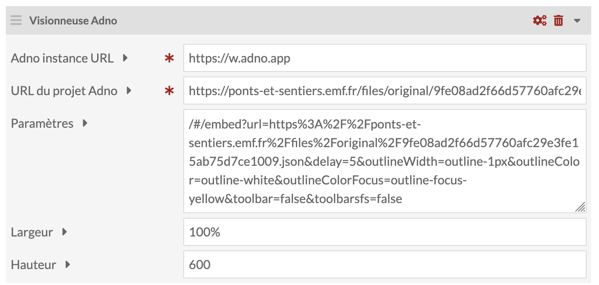
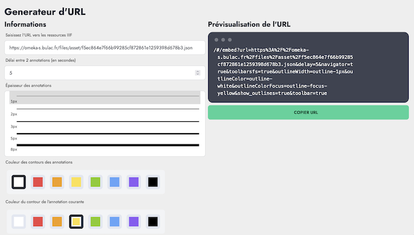

Depuis ses débuts, Adno offre la possibilité de visualiser un projet dans une page web via la balise `ìframe`. Cependant, la manip n'est pas toujours évidente ni même permise. 

Ce nouveau module facilite l'insertion de projets Adno dans les pages de sites Omeka-S. Il ajoute un bloc « Visionneuse Adno » à la liste des bloc disponible pour composer une page sans devoir insérer du code HTML.  

Le bloc requière deux paramètres obligatoires : 

- l'url de l'installation de Adno (par défaut : https://w.adno.app)
- l'url du projet Adno ou d'une images statique ou IIIF

s'ajoutent trois autres champs optionnels :

- des paramètres pour surcharger les paramètres pré-enregistrés dans le projet, Adno fournit un service #link pour les régler.  

- la largeur de l'Iframe (% ou px) 100% par defaut
- la hauteur de l'Iframe (px) 600px par défaut

Plusieurs blocs Adno peuvent êtres insérés dans une même page 

Il est possible de déposer un projet Adno, comme media associé à un item. Pour ce faire, il faut autoriser le type MIME application/json et l'extension .jsonin dans la partie sécurité des réglages de Omeka-S.

Le module ainsi que ls instructions d'installation sont disponibles sur GitHub : [https://github.com/adnodev/Omeka-S-module-PageBlockAdno](https://github.com/adnodev/Omeka-S-module-PageBlockAdno).
